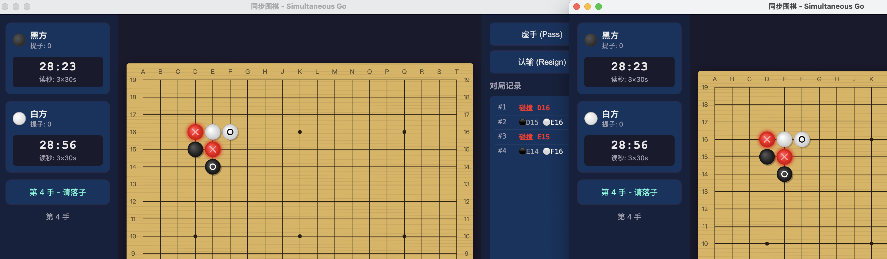

# 同步围棋 (Simultaneous Go)

一个围棋变体游戏，双方在每一步中同时下棋。使用 Node.js + Electron 构建。

## 游戏特色

- **同步落子**: 每一步中，黑白双方同时选择落子位置，双方都提交后才揭示
- **红色棋子**: 如果双方下在同一个位置，该位置变为红色棋子（永久固定，不可吃）
- **局域网对弈**: 两台电脑通过局域网连接对弈
- **人机对弈**: 内置 AI 引擎，支持简单/中等/困难三个难度
- **完整计时**: 支持多种基本用时 + 3次30秒读秒

## 安装

```bash
npm install
```

## 运行

```bash
# 正常启动
npm start

# 开发模式（带开发者工具）
npm run dev
```

## 游戏规则

### 落子
1. 每一步中，黑白双方各自选择一个位置落子（或虚手）
2. 双方都提交后，才在棋盘上显示双方的棋子
3. 如果双方下在同一个位置，该位置变为**红色棋子**

### 红色棋子
- 红棋一旦出现，永久固定不动
- 红棋不能被吃掉
- 红棋会减少相邻棋组的气
- 红棋不算任何一方的棋子

### 提子
- 双方落子后，同时检查所有棋组的气
- 所有没有气的棋组同时被提掉
- 如果双方棋组同时没气（双杀），两组都提掉

### 计时
- 基本用时可选：10分钟 ~ 5小时
- 基本用时可自由分配到每一步
- 用完后进入读秒：3次30秒
- 三次读秒用完后不能再落子

### 胜负
- 双方都虚手时游戏结束
- 使用中国规则（数子法）：棋子数 + 围住的空 = 得分
- 红棋不算任何一方的分数

## 对弈方式

### 局域网对弈
1. 一方选择"创建房间"，记下显示的 IP 地址和端口
2. 另一方选择"加入房间"，输入对方的 IP 地址和端口
3. 连接成功后游戏自动开始

### 人机对弈
1. 选择"人机对弈"
2. 选择颜色、AI 难度和用时
3. 点击开始游戏

## 技术栈

- **Electron** - 桌面应用框架
- **Node.js** - 运行时
- **WebSocket (ws)** - 网络通信
- **HTML5 Canvas** - 棋盘渲染
- **MCTS** - AI 算法

## 项目结构

```
gogame/
├── main.js                 # Electron 主进程入口
├── preload.js              # 上下文桥接
├── src/
│   ├── main/               # 主进程
│   │   ├── server.js       # WebSocket 服务器
│   │   ├── ipc-handlers.js # IPC 消息处理
│   │   ├── game/           # 游戏引擎
│   │   │   ├── board.js    # 棋盘数据结构
│   │   │   ├── rules.js    # 规则验证
│   │   │   ├── scoring.js  # 计分
│   │   │   ├── timer.js    # 计时器
│   │   │   └── game-engine.js # 游戏引擎
│   │   └── ai/
│   │       └── ai-player.js # AI 引擎
│   ├── renderer/           # 渲染进程
│   │   ├── index.html      # 主页面
│   │   ├── styles/         # 样式
│   │   └── js/
│   │       └── app.js      # 应用逻辑
│   └── shared/             # 共享模块
│       ├── constants.js    # 常量
│       └── protocol.js     # 通信协议
└── plans/
    └── architecture.md     # 架构设计文档
```
