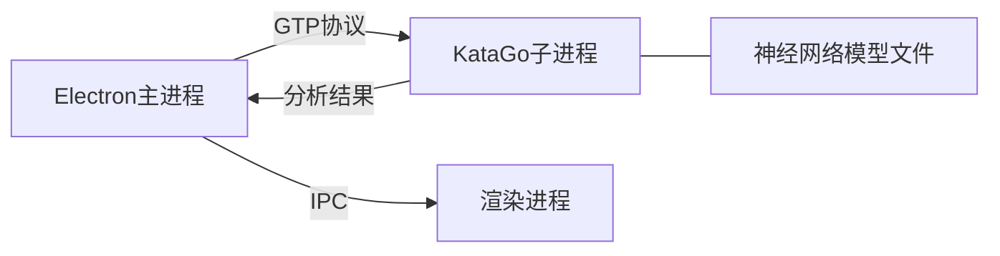
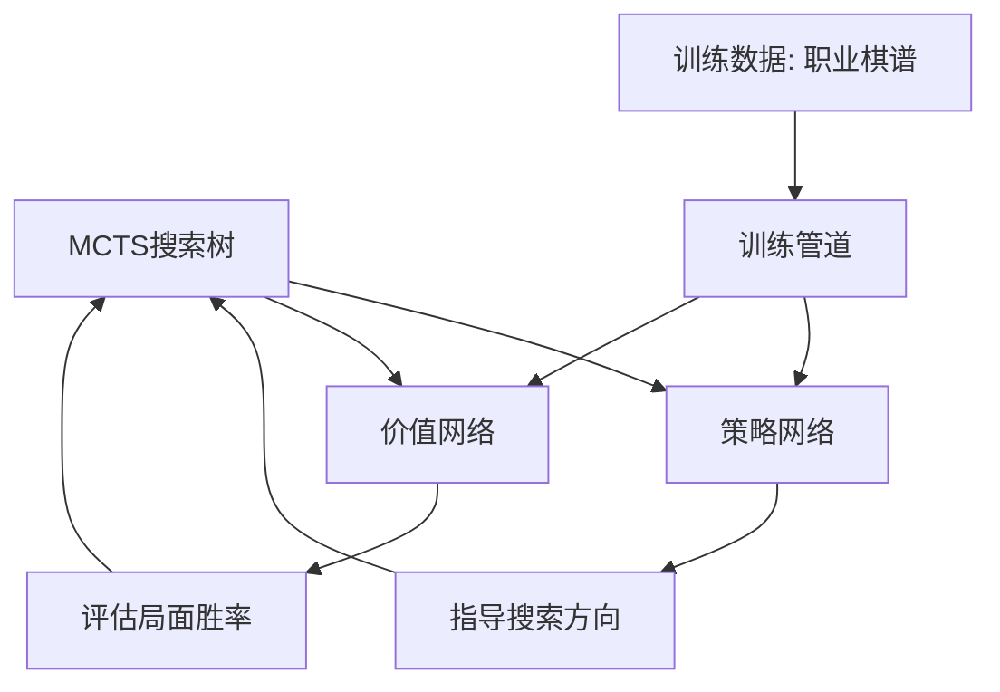
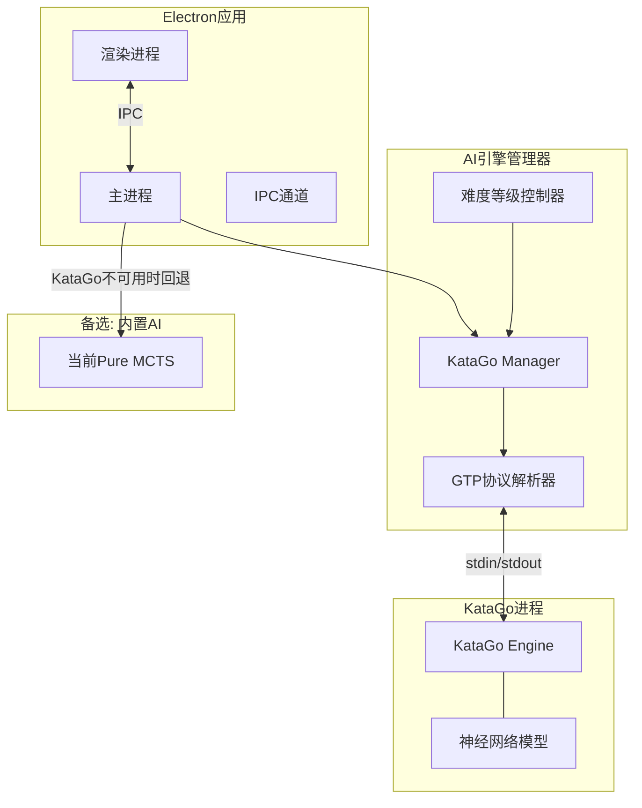
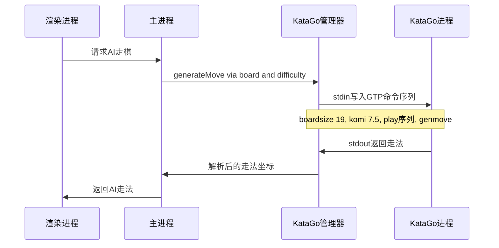
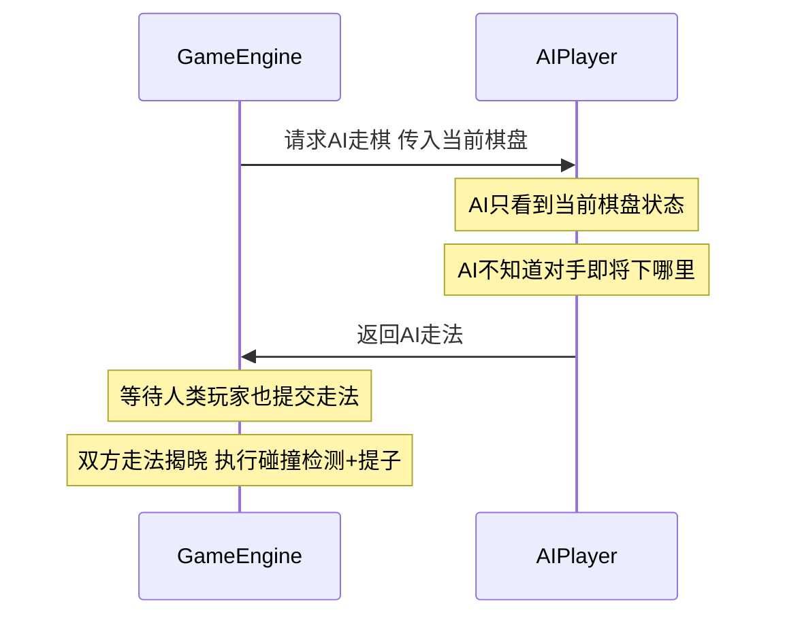
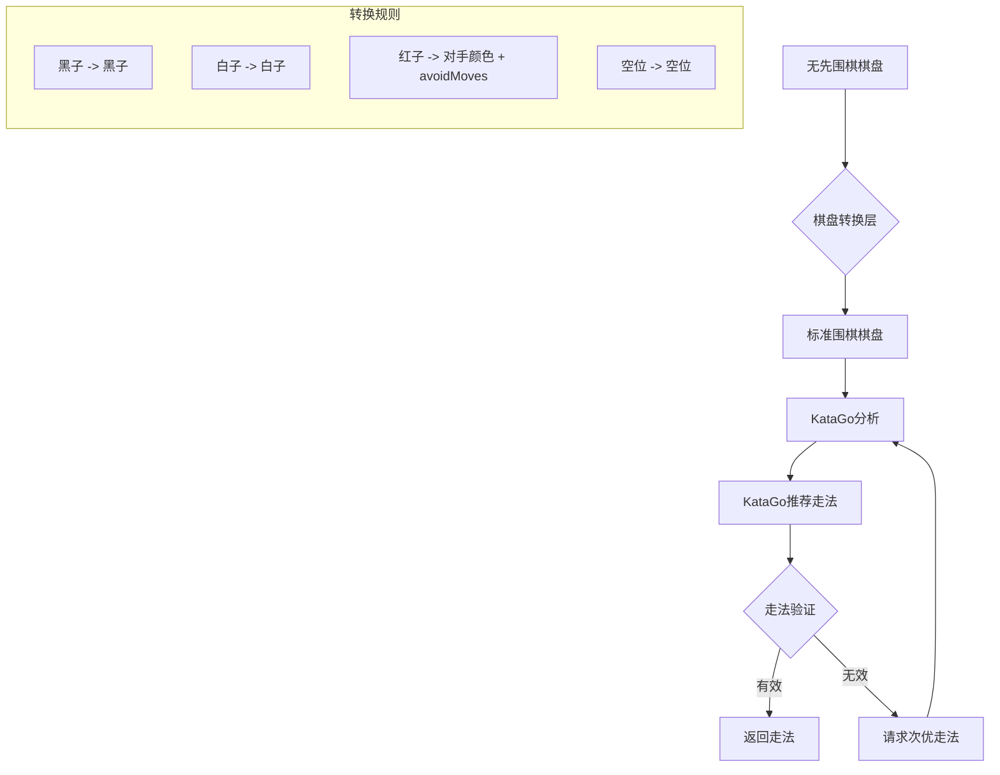
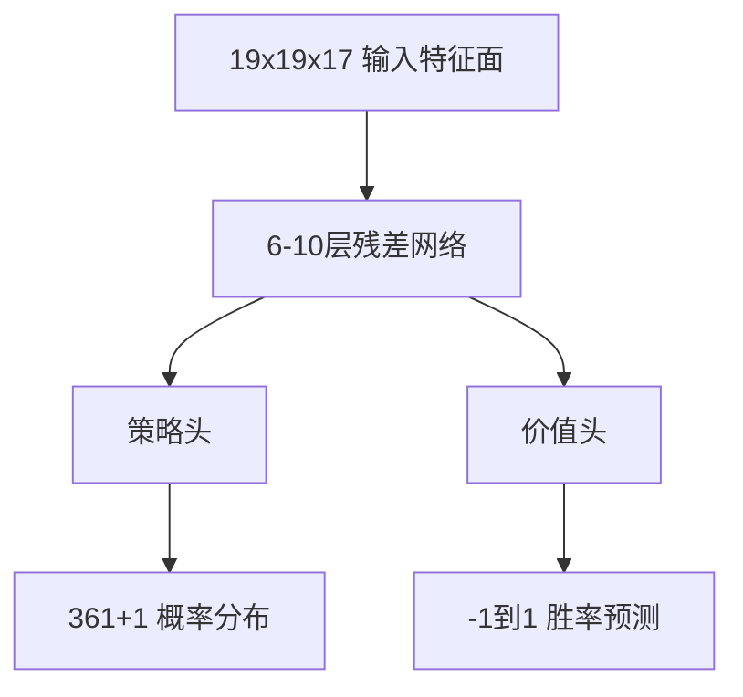
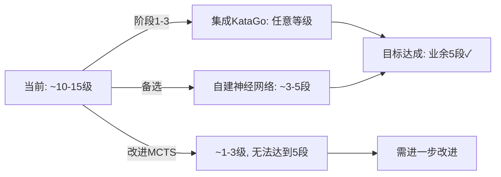

# 同弈围棋 AI 升级至业余五段水平 — 详细计划

## 1. 现状分析

### 1.1 当前AI架构

当前 [`AIPlayer`](src/main/ai/ai-player.js) 采用的是**纯MCTS（蒙特卡洛树搜索）**，无神经网络辅助。

| 参数 | Easy | Medium | Hard |
|---|---|---|---|
| MCTS迭代次数 | 400 | 2,000 | 8,000 |
| 最大模拟深度 | 40 | 80 | 120 |
| 预估棋力 | ~25-30级 | ~15-20级 | ~10-15级 |

### 1.2 已实现的功能

- ✅ UCB1选择策略 + 启发式扩展排序
- ✅ 智能随机模拟（避免填自己的眼）
- ✅ 洪水填充领地评估
- ✅ 战术落子生成（叫吃应对、吃子）
- ✅ 开局定式（星位、小目、三三）
- ✅ 邻近棋子候选点生成
- ✅ Worker Thread 异步执行

### 1.3 缺失的关键能力

| 缺失能力 | 对棋力的影响 |
|---|---|
| 神经网络评估 | 致命 — 这是从级位到段位的最大瓶颈 |
| 征子/梯子判断 | 严重 — 经常导致灾难性失误 |
| 死活判断 | 严重 — 无法识别基本死活 |
| 对杀分析 | 严重 — 中盘战斗能力极弱 |
| RAVE/AMAF | 中等 — 搜索效率低下 |
| 3×3棋型库 | 中等 — 模拟质量差 |
| 渐进拓宽 | 中等 — 搜索宽度浪费 |
| 棋型数据库 | 中等 — 无法识别常见棋形 |

### 1.4 棋力差距分析

```
当前水平:  ~10-15级 (Hard模式)
目标水平:  业余5段

棋力差距约 15-20个等级, ELO差距约 1200-1500分
这是一个巨大的鸿沟, 需要根本性的架构改变
```

---

## 2. 可选方案比较

### 方案A：集成KataGo引擎（推荐 ⭐）

**原理**：将KataGo作为子进程运行，通过GTP协议通信。



| 优点 | 缺点 |
|---|---|
| 立即达到超人类水平 | 需要额外二进制文件约50-200MB |
| 成熟可靠的技术 | GPL许可证限制 |
| 可精确控制棋力等级 | 需要为不同平台编译 |
| 社区维护, 持续更新 | GPU优化需要额外配置 |
| 支持分析模式 | 冷启动较慢约2-5秒 |

**棋力范围**: 可以从30级到职业九段自由调节

### 方案B：构建轻量级神经网络

**原理**：训练一个小型策略+价值网络，集成到现有MCTS中。



| 优点 | 缺点 |
|---|---|
| 完全自主的技术栈 | 需要大量开发工作 |
| 可深度定制 | 需要训练基础设施和GPU |
| 模型体积可控约5-20MB | 需要高质量训练数据 |
| 无许可证问题 | 棋力上限取决于网络大小和训练质量 |

**预估棋力**: 小型网络约业余1-3段, 中型网络约业余5-7段

### 方案C：大幅改进纯MCTS（不推荐达到5段）

**原理**：在不使用神经网络的情况下，最大化传统MCTS的能力。

| 改进项 | 预估提升 |
|---|---|
| 3×3棋型库 | +3-5级 |
| RAVE/AMAF | +2-3级 |
| 征子检测 | +1-2级 |
| 更多迭代次数至100K+ | +2-3级 |
| 死活判断 | +2-3级 |
| 天梯对弈自动调参 | +1-2级 |

**预估上限**: 业余1-3级（kyu），极难突破到段位

---

## 3. 推荐方案：KataGo集成 + 棋力调节

### 3.1 为什么选择KataGo

1. **直接达标**：KataGo本身棋力远超业余5段，通过参数调节可以精确控制在5段水平
2. **开发成本最低**：主要工作是集成和通信，不需要训练模型
3. **用户体验好**：启动快、响应快、棋力稳定
4. **可扩展**：未来可以提供"AI分析"功能，让用户复盘时使用

### 3.2 KataGo棋力调节机制

KataGo可以通过以下参数精确控制棋力：

```
# 降低搜索次数 (playouts)
maxVisits = 1       → ~10级
maxVisits = 10      → ~5级  
maxVisits = 50      → ~1级
maxVisits = 200     → ~业余1段
maxVisits = 800     → ~业余3段
maxVisits = 3000    → ~业余5段
maxVisits = 10000   → ~业余7段
maxVisits = 100000  → 职业水平

# 加入随机性降低棋力
humanSLProfile = 弱    → 模拟人类弱棋力
rootPolicyTemperature   → 增加随机性
```

### 3.3 集成架构



---

## 4. 详细实施计划

### 阶段一：KataGo集成基础

#### 4.1 创建KataGo管理器模块

新建 `src/main/ai/katago-manager.js`：

- KataGo子进程生命周期管理（启动、停止、重启）
- GTP协议通信（stdin/stdout）
- 超时和错误处理
- 进程崩溃自动恢复

#### 4.2 实现GTP协议解析器

新建 `src/main/ai/gtp-protocol.js`：

- GTP命令发送（`genmove`、`play`、`boardsize`、`komi`等）
- GTP响应解析
- 异步命令队列（确保命令按顺序执行）
- 分析模式命令（`kata-analyze`）

#### 4.3 KataGo配置管理

新建 `src/main/ai/katago-config.js`：

- 动态生成KataGo配置文件
- 难度等级映射到搜索参数
- GPU/CPU模式自动检测
- 内存使用限制

### 阶段二：难度系统重构

#### 4.4 扩展难度等级

修改 [`constants.js`](src/shared/constants.js) 中的 `AI_DIFFICULTY`：

```javascript
const AI_DIFFICULTY = {
  EASY: 'easy',           // ~20级 (maxVisits=5)
  MEDIUM: 'medium',       // ~10级 (maxVisits=30)
  HARD: 'hard',           // ~1级  (maxVisits=200)
  DAN_1: 'dan_1',         // 业余1段 (maxVisits=500)
  DAN_3: 'dan_3',         // 业余3段 (maxVisits=1500)
  DAN_5: 'dan_5',         // 业余5段 (maxVisits=3000)
  DAN_7: 'dan_7',         // 业余7段 (maxVisits=10000)
  PROFESSIONAL: 'professional' // 职业级 (maxVisits=100000)
};
```

#### 4.5 智能回退机制

修改 [`ai-player.js`](src/main/ai/ai-player.js)：

- 如果KataGo可用，使用KataGo生成走法
- 如果KataGo不可用（未安装/启动失败），回退到现有Pure MCTS
- 在UI中显示当前使用的AI引擎

### 阶段三：KataGo分发和安装

#### 4.6 KataGo二进制打包

- macOS：打包KataGo aarch64 + x86_64通用二进制
- Windows：打包KataGo Windows二进制
- Linux：打包KataGo Linux二进制
- 使用electron-builder的extraResources配置

#### 4.7 神经网络模型管理

- 内置小型模型（约20-40MB, b6c96级别, 足够达到业余5段+）
- 可选下载更大的模型（b18c384, 约200MB, 职业级）
- 首次启动时检查模型文件完整性

#### 4.8 GPU/CPU自动检测

- 检测系统是否有可用GPU（CUDA/OpenCL/Metal）
- 自动选择最优后端
- macOS上使用Metal/CoreML加速
- 无GPU时使用CPU模式（eigen后端）, 适当降低搜索次数

### 阶段四：用户界面更新

#### 4.9 难度选择UI

修改 [`index.html`](src/renderer/index.html) 和 [`app.js`](src/renderer/js/app.js)：

- 难度滑块（从30级到职业级）
- 显示预估棋力（段/级标注）
- KataGo状态指示器（就绪/加载中/不可用）

#### 4.10 AI分析功能（附加价值）

- 对局后AI复盘分析
- 显示每手棋的胜率变化曲线
- 显示AI推荐的最优走法
- 标记失误手（胜率下降超阈值的着法）

### 阶段五：同步围棋适配

#### 4.11 Red Stone处理

KataGo不原生支持红子（碰撞标记），需要特殊处理：

- 使用GTP的 `play` 命令模拟红子为不可落子点
- 或使用自定义棋盘初始化，将红子位置标记为已占用
- 在发送棋盘状态给KataGo时，将红子转为特殊处理

#### 4.12 同步模式适配

- KataGo以普通围棋模式运行
- AI看不到对手即将下的棋（符合同步围棋规则）
- 碰撞后的红子需要在KataGo的棋盘表示中处理

### 阶段六：测试和优化

#### 4.13 棋力验证

- 使用已知棋谱测试AI走法质量
- 与其他已知棋力的引擎对弈
- 验证不同难度等级的实际棋力

#### 4.14 性能优化

- KataGo预热（应用启动时就初始化）
- 对手思考时让KataGo进行背景分析（ponder）
- 内存使用监控和限制

---

## 5. 技术细节

### 5.1 GTP协议核心命令

```
# 初始化
boardsize 19
komi 7.5
clear_board

# 走棋
play black D4
play white Q16
genmove black          → AI生成黑方走法
genmove white          → AI生成白方走法

# 分析
kata-analyze black 1000  → 分析1000次搜索的结果
kata-get-param humanSLProfile → 获取人类模拟参数

# 控制棋力
kata-set-param maxVisits 3000
kata-set-param humanSLNetworkFile <model_path>
```

### 5.2 KataGo配置示例（业余5段）

```ini
# analysis_config.cfg
numSearchThreads = 4
maxVisits = 3000
# 使用human SL网络模拟人类风格
humanSLProfile = preaz_18k
# 或直接限制搜索
maxPlayouts = 3000
```

### 5.3 进程通信示意



---

## 6. KataGo与无先围棋的兼容性详细分析

### 6.1 无先围棋的三大特殊机制

| 特殊机制 | 说明 | KataGo原生支持 |
|---|---|---|
| 同步落子 | 双方同时落子，互不知对方走法 | ⚠️ 不适用 - 但无需支持 |
| 红子/碰撞 | 双方落在同一位置时产生红子，永久存在，阻断气，不计领地 | ❌ 不支持 |
| 互杀提子 | 同步放置后，双方零气棋组同时移除 | ❌ 不支持 - 但由自有引擎处理 |

### 6.2 逐项兼容性分析

#### ✅ 同步落子 - 完全兼容，无需特殊处理

这是最关键的好消息。在当前架构中，AI生成走法的流程是：



KataGo的工作方式完全相同：
- 它接收当前棋盘状态
- 它生成最优走法
- 它**不需要**知道对手会下哪里
- 同步机制完全由 [`Rules.resolveTurn()`](src/main/game/rules.js:80) 处理

**结论：同步落子对KataGo集成毫无影响。**

#### ⚠️ 红子处理 - 需要适配层（核心难点）

红子 [`STONE.RED = 3`](src/shared/constants.js:16) 的关键属性：
1. **占据位置** - 无人可在此落子
2. **阻断气** - 只有 `STONE.EMPTY` 才算气（见 [`Board.countLiberties()`](src/main/game/board.js:122)）
3. **永不被移除** - 红子是永久的
4. **不计领地** - 计分时红子不属于任何一方（见 [`Scoring.calculate()`](src/main/game/scoring.js:64)）

KataGo只理解三种状态：空、黑、白。需要一个**棋盘转换层**。

**推荐方案：将红子转换为对手颜色 + avoidMoves**

```
无先棋盘:                KataGo棋盘 - AI执黑时:
+--+--+--+--+--+        +--+--+--+--+--+
|  |● |  |  |  |        |  |● |  |  |  |
+--+--+--+--+--+        +--+--+--+--+--+
|● |红 |○ |  |  | -->   |● |○ |○ |  |  |   红子转为白子
+--+--+--+--+--+        +--+--+--+--+--+
|  |○ |  |  |  |        |  |○ |  |  |  |
+--+--+--+--+--+        +--+--+--+--+--+
```

这个转换的正确性分析：

| 红子属性 | 转为对手色后的表现 | 是否正确 |
|---|---|---|
| 占据位置 无法落子 | ✅ 对手色位置KataGo不会在此落子 | 正确 |
| 阻断相邻棋组的气 | ✅ 对手色的子同样会阻断气 | 正确 |
| 永不被移除 | ⚠️ KataGo可能认为可以吃掉这些子 | 需处理 |
| 不计领地 | ⚠️ KataGo会将其计为对手领地 | 评估微小偏差 |

**处理不可移除问题：** 使用KataGo分析API的 `avoidMoves` 参数

```json
{
  "id": "move_query",
  "initialStones": [
    ["B", "B2"], ["W", "C3"],
    ["W", "B3"]
  ],
  "moves": [],
  "rules": "chinese",
  "komi": 7.5,
  "maxVisits": 3000,
  "avoidMoves": [
    {"player": "B", "moves": ["B3"], "untilDepth": 999},
    {"player": "W", "moves": ["B3"], "untilDepth": 999}
  ]
}
```

通过 `avoidMoves` 确保KataGo在搜索时不会尝试在红子位置落子，配合 `initialStones` 中的对手色来模拟红子的气阻断效果。

**领地评估偏差的影响：**
- 红子数量通常远少于正常棋子（碰撞概率较低）
- KataGo可能略微高估对手实力
- 实际影响约 -100 至 -200 ELO，在5段目标下可以接受
- 必要时可通过微调贴目参数来补偿

#### ✅ 互杀提子 - 无需KataGo处理

互杀提子完全由 [`Rules.resolveTurn()`](src/main/game/rules.js:80) 处理：

```javascript
// 同时查找并移除双方死子
const deadBlack = board.findDeadGroups(STONE.BLACK);
const deadWhite = board.findDeadGroups(STONE.WHITE);
board.removeStones(result.capturedBlack);
board.removeStones(result.capturedWhite);
```

KataGo只负责生成走法，不参与提子逻辑。互杀后的棋盘状态会在下一次请求AI走法时传给KataGo。

### 6.3 完整的棋盘转换流程



### 6.4 碰撞策略的进阶考虑

无先围棋中存在一个标准围棋AI不需要考虑的博弈论问题：**碰撞概率**。

在关键点位（如双方都想占的大场），存在碰撞变为红子的风险。理想的无先围棋AI应该：
1. 评估某个点位的碰撞概率
2. 如果碰撞概率高，考虑选择次优但不易碰撞的位置
3. 这是混合策略纳什均衡问题（类似猜拳）

**初始版本可以忽略此问题**，但未来可通过包装层实现：
- 用KataGo评估己方和对手的TOP-N走法
- 如果双方的第一选择相同（碰撞风险高），按概率选择第二或第三推荐
- 添加适度的随机性来降低可预测性

### 6.5 对AI棋力的影响评估

| 方面 | 影响程度 | 说明 |
|---|---|---|
| 同步落子的不确定性 | 无影响 | 标准围棋分析即可 |
| 红子的位置评估 | 轻微 约-100 ELO | 神经网络未见过中立阻隔物 |
| 红子导致的异常棋形 | 轻微 约-50 ELO | 可能出现标准围棋中不存在的棋形 |
| 互杀可能性 | 无影响 | 由自有引擎处理 |
| 碰撞策略博弈 | 中等 约-200 ELO | KataGo无法进行碰撞预测 |
| **总计** | **约-200至-350 ELO** | **仍在业余4-5段水平** |

**结论**：KataGo在 `maxVisits=3000` 时基础棋力约业余5-6段（约2400 ELO），扣除无先围棋适配偏差后仍在**业余4-5段水平**，完全满足目标。

---

## 7. 文件结构变化

```
src/main/ai/
├── ai-player.js          # 现有: Pure MCTS (保留为回退方案)
├── ai-worker.js          # 现有: Worker Thread
├── katago-manager.js     # 新增: KataGo进程管理
├── gtp-protocol.js       # 新增: GTP协议实现
├── katago-config.js      # 新增: KataGo配置生成
├── board-translator.js   # 新增: 无先棋盘→标准棋盘转换层
├── difficulty-mapper.js  # 新增: 难度等级到引擎参数映射
└── ai-engine-factory.js  # 新增: AI引擎工厂 (KataGo/PureMCTS切换)

resources/
├── katago/
│   ├── katago-mac-arm64      # macOS ARM64二进制
│   ├── katago-mac-x64        # macOS x64二进制
│   ├── katago-win-x64.exe    # Windows二进制
│   ├── katago-linux-x64      # Linux二进制
│   └── models/
│       └── b6c96.bin.gz      # 小型神经网络模型约30MB
```

---

## 8. 备选方案：方案B（自建轻量级神经网络）

如果因为许可证或包大小原因不想集成KataGo，可以考虑自建神经网络：

### 7.1 网络架构



**输入特征**（17个平面）：
- 当前黑子位置
- 当前白子位置
- 红子位置
- 最近8手的黑/白落子历史
- 当前执棋方
- 各点气数
- 征子状态

### 7.2 训练流程

1. 收集职业棋谱（KGS、GoGoD、Tygem等，约10万局以上）
2. 数据预处理为训练格式
3. 使用PyTorch训练策略+价值网络
4. 导出为ONNX格式
5. 在Node.js中使用onnxruntime-node进行推理

### 7.3 推理集成

```javascript
// 使用 onnxruntime-node
const ort = require('onnxruntime-node');
const session = await ort.InferenceSession.create('model.onnx');
const input = prepareFeatures(board);
const results = await session.run({ input });
const policy = results.policy.data;   // 362维概率
const value = results.value.data[0];  // 胜率
```

### 7.4 此方案的预估棋力

| 网络规模 | 参数量 | 模型大小 | 搜索次数 | 预估棋力 |
|---|---|---|---|---|
| 6×64 | ~200K | ~1MB | 1600 | 业余1-2段 |
| 6×96 | ~500K | ~2MB | 3200 | 业余2-4段 |
| 10×128 | ~1.5M | ~6MB | 3200 | 业余4-5段 |
| 15×192 | ~5M | ~20MB | 6400 | 业余6-7段 |
| 20×256 | ~15M | ~60MB | 10000 | 业余7段+ |

---

## 9. 对当前Pure MCTS的可选改进

即使不达到5段, 以下改进也能显著提升当前AI的棋力：

### 8.1 征子检测（约提升2-3级）

```javascript
// 在 ai-player.js 中添加征子检测
_detectLadder(board, x, y, color) {
  // 模拟征子序列, 检查是否能逃脱
  // 如果征子成功, 返回高优先级
  // 如果征子失败, 避免无谓的征子尝试
}
```

### 8.2 3×3棋型库（约提升3-5级）

为模拟（playout）阶段添加常见棋型识别：
- 虎口、飞、关、跳等基本形状
- 在模拟中优先选择符合棋型的走法
- 使用哈希表快速查找

### 8.3 RAVE/AMAF启发式（约提升2-3级）

```javascript
// 在MCTSNode中添加RAVE统计
class MCTSNode {
  constructor() {
    // ... 现有字段
    this.raveWins = 0;
    this.raveVisits = 0;
  }
  
  get combinedValue() {
    const beta = Math.sqrt(RAVE_CONSTANT / (3 * this.parent.visits + RAVE_CONSTANT));
    const exploitation = this.wins / this.visits;
    const rave = this.raveWins / this.raveVisits;
    return (1 - beta) * exploitation + beta * rave;
  }
}
```

---

## 10. 总结与建议

### 达到业余5段的推荐路径



| 方案 | 能否达到5段 | 开发工作量 | 推荐度 |
|---|---|---|---|
| **方案A: 集成KataGo** | ✅ 轻松达到 | 中等 | ⭐⭐⭐⭐⭐ |
| **方案B: 自建神经网络** | ✅ 可以达到 | 巨大 | ⭐⭐⭐ |
| **方案C: 改进纯MCTS** | ❌ 极难达到 | 中等 | ⭐⭐ |

**核心观点**：没有神经网络，纯MCTS在19路棋盘上几乎不可能达到业余段位水平。AlphaGo的历史证明了神经网络对围棋AI的革命性意义。KataGo集成是成本效益比最高的选择；如果追求完全自主的技术栈，则需要投入训练自己的神经网络。
