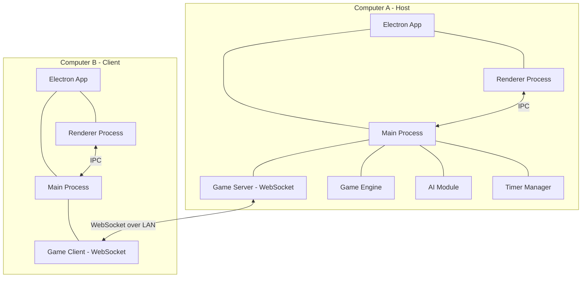
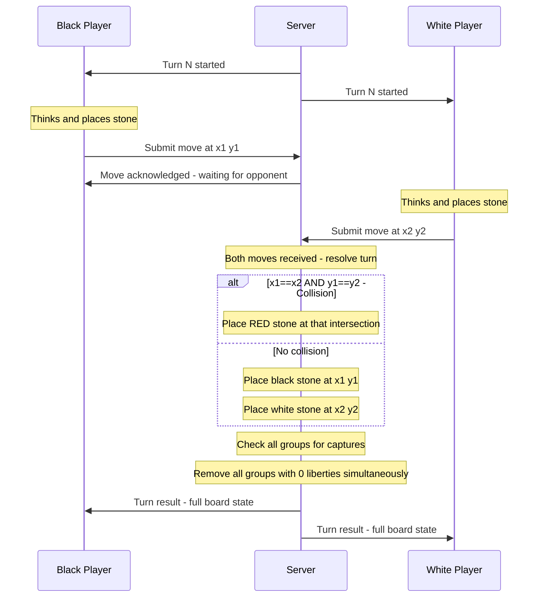
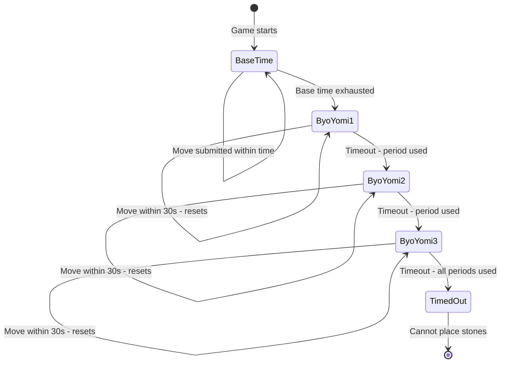
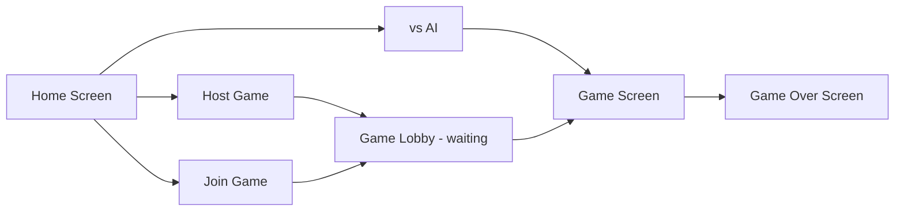
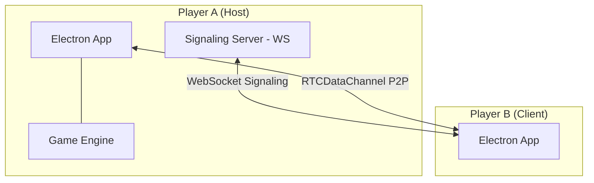
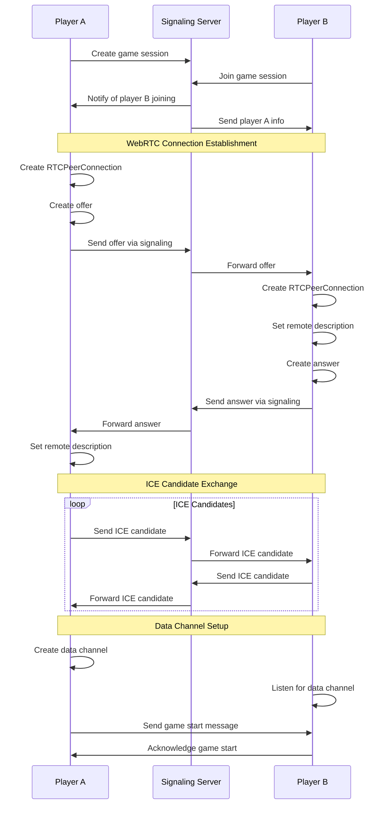

# 同步围棋 (Simultaneous Go) - Architecture Design

## 1. Overview

A Go (围棋) variant where both players place stones simultaneously each turn. Built with **Node.js + Electron** for LAN play on two computers.

### Core Variant Rules
- **Simultaneous moves**: Each turn, both Black and White place a stone without seeing the opponent's move. Once both submit, moves are revealed on both boards.
- **Red stones**: If both players place on the same intersection, a **red stone** appears. Red stones are permanent, uncapturable, and reduce adjacent groups' liberties.
- **Mutual capture**: After simultaneous placement, all groups with 0 liberties are removed simultaneously. Mutual kills remove both groups.
- **Scoring**: Chinese area scoring. Red stones count for neither side.

---

## 2. System Architecture



### Architecture Pattern: Host-Client Model

- **Host** (Computer A): Runs both the game server and a client. The server is authoritative for game state, timer, and move resolution.  
- **Client** (Computer B): Connects to the host via WebSocket. Only submits moves and receives resolved board states.
- **AI Mode**: When playing vs AI, the host runs both the player client and the AI engine — no network needed.

---

## 3. Game Flow

### 3.1 Turn-Based Simultaneous Move Flow



### 3.2 Pass and End Game

- A player may **pass** instead of placing a stone
- If both players pass in the same turn, the game ends
- Scoring is then computed using Chinese area scoring

### 3.3 Timeout Handling

- If a player runs out of all 3 byo-yomi periods, they can no longer place stones
- The opponent continues until they also pass or stop
- Final scoring determines the winner

---

## 4. Game Engine Design

### 4.1 Board Representation

```
Board: 19x19 array
Cell values:
  0 = Empty
  1 = Black
  2 = White
  3 = Red (collision)
```

### 4.2 Move Validation

Per-player validation is done on their visible board state before the opponent's move is known:

1. Intersection must be empty on the player's visible board
2. Placement must not be suicide - the resulting group must have at least 1 liberty, OR the placement captures at least one opponent group
3. Ko rule: Cannot recreate the exact board position from two turns ago - adapted for simultaneous play, we use **superko** - positional superko, no repeating any previous board state

### 4.3 Simultaneous Resolution Algorithm

```
function resolveTurn(board, blackMove, whiteMove):
    if blackMove == whiteMove:
        // Collision - place red stone
        board[blackMove] = RED
    else:
        if blackMove != PASS:
            board[blackMove] = BLACK
        if whiteMove != PASS:
            board[whiteMove] = WHITE
    
    // Capture phase - simultaneous
    capturedBlack = findGroupsWithZeroLiberties(board, BLACK)
    capturedWhite = findGroupsWithZeroLiberties(board, WHITE)
    
    // Remove all captured stones at once
    removeStones(board, capturedBlack)
    removeStones(board, capturedWhite)
    
    // After removal, Red stones are NEVER removed
    return board
```

### 4.4 Liberty Counting

```
function countLiberties(board, group):
    liberties = Set()
    for each stone in group:
        for each adjacent intersection:
            if board[adjacent] == EMPTY:
                liberties.add(adjacent)
            // RED stones are NOT empty - they block liberties
    return liberties.size
```

### 4.5 Scoring - Chinese Area Scoring

```
function score(board):
    blackScore = count stones where board[x][y] == BLACK
    whiteScore = count stones where board[x][y] == WHITE
    
    // Territory: empty regions fully surrounded by one color
    // Red stones act as walls - they block territory claims
    for each empty region:
        adjacentColors = colors touching this region (excluding RED)
        if only BLACK touches this region:
            blackScore += region size
        else if only WHITE touches this region:
            whiteScore += region size
        // Mixed or touching RED only = neutral territory
    
    // Red stone intersections count for neither side
    return { blackScore, whiteScore }
```

---

## 5. Networking Protocol

### 5.1 Transport

- **WebSocket** via the `ws` npm package
- Host starts a WebSocket server on a configurable port, default `38765`
- Client connects via `ws://HOST_IP:38765`
- LAN discovery: Manual IP entry, with optional mDNS/Bonjour auto-discovery

### 5.2 Message Protocol

JSON-based messages with a `type` field:

| Message Type | Direction | Payload |
|---|---|---|
| `join` | Client → Server | `{ playerName }` |
| `joined` | Server → Client | `{ color, gameSettings }` |
| `game_start` | Server → Both | `{ boardSize, timeSettings }` |
| `turn_start` | Server → Both | `{ turnNumber }` |
| `submit_move` | Client → Server | `{ x, y }` or `{ pass: true }` |
| `move_ack` | Server → Client | `{ waiting: true }` |
| `turn_result` | Server → Both | `{ board, blackMove, whiteMove, captures, isCollision, timers }` |
| `time_update` | Server → Both | `{ blackTime, whiteTime, blackByoYomi, whiteByoYomi }` |
| `game_end` | Server → Both | `{ reason, blackScore, whiteScore, winner }` |
| `chat` | Both | `{ message }` |
| `resign` | Client → Server | `{}` |

### 5.3 Reconnection

- If a client disconnects, the server pauses the timer
- The client can reconnect and resume with the current board state
- Timeout after 5 minutes of no reconnection = forfeit

---

## 6. Time Control System

### 6.1 Configuration

| Base Time Options |
|---|
| 10 min, 15 min, 20 min, 30 min, 45 min |
| 1 hr, 1.5 hr, 2 hr, 3 hr, 5 hr |

- **Byo-yomi**: 3 periods of 30 seconds each
- Base time is freely allocated across moves
- After base time expires, each move must be completed in 30 seconds
- Exceeding 30 seconds uses one byo-yomi period and resets to 30 seconds
- After 3 timeouts, the player cannot place more stones

### 6.2 Timer Architecture

- **Server-authoritative**: The server tracks the canonical timer for both players
- Timer starts when `turn_start` is sent
- Timer pauses per-player when their `submit_move` is received
- Timer broadcasts `time_update` every second to both clients
- Client displays the timer but does not make timing decisions



---

## 7. AI Module

### 7.1 Approach: Monte Carlo Tree Search - Simplified

Since this is a built-in simple AI, we use a lightweight MCTS approach:

- **Random playouts** with basic heuristics
- **Pattern matching** for common shapes like eyes, atari, and captures
- **Difficulty levels**: Easy, Medium, Hard - controlled by playout count
- The AI doesn't know the opponent's simultaneous move in advance - it plays as if it's a normal Go game from its perspective

### 7.2 AI Integration

- AI runs in the main process as a Worker Thread
- When it's the AI's turn in a simultaneous round, the AI computes its move independently and submits to the game engine
- AI follows the same rules as a network player

---

## 8. UI Design

### 8.1 Main Screens



### 8.2 Game Screen Layout

```
+-------------------------------------------+
|  Logo    Player Info    Timer Display      |
+-------------------------------------------+
|                                            |
|           +-------------------+            |
|           |                   |            |
|           |    19x19 Go Board |            |
|           |    Canvas Render  |            |
|           |                   |            |
|           +-------------------+            |
|                                            |
|  Status Bar: Turn info / Waiting / Result  |
|  [Pass] [Resign] [Settings]               |
+-------------------------------------------+
```

### 8.3 Board Rendering

- **HTML5 Canvas** for performant board rendering
- Board grid with standard Go aesthetics - wood texture background
- Stone styles:
  - **Black** stones: Solid black circles with subtle gradient
  - **White** stones: White circles with shadow
  - **Red** stones: Bright red circles with glow effect - visually distinct
- Last move indicator
- Hover preview for stone placement
- Animation for stone placement and captures

### 8.4 Information Display

- **Player panel**: Name, color, captured stones count
- **Timer panel**: Base time remaining, byo-yomi periods remaining
- **Turn indicator**: Whose turn it is, waiting status
- **Move history**: List of moves per turn showing both colors

---

## 9. Project Structure

```
gogame/
├── package.json
├── electron-builder.json       # Electron packaging config
├── main.js                     # Electron main entry
├── preload.js                  # Context bridge
├── src/
│   ├── main/                   # Main process
│   │   ├── app-manager.js      # Window and app lifecycle
│   │   ├── server.js           # WebSocket game server
│   │   ├── ipc-handlers.js     # IPC message handlers
│   │   ├── game/
│   │   │   ├── game-engine.js  # Core game logic
│   │   │   ├── board.js        # Board state and operations
│   │   │   ├── rules.js        # Move validation and captures
│   │   │   ├── scoring.js      # Territory scoring
│   │   │   └── timer.js        # Time control
│   │   ├── ai/
│   │   │   ├── ai-player.js    # AI interface
│   │   │   └── mcts.js         # MCTS implementation
│   │   └── webrtc/
│   │       ├── index.js            # Module exports
│   │       ├── webrtc-manager.js   # RTCPeerConnection management
│   │       └── signaling-handler.js # WebSocket signaling
│   ├── renderer/               # Renderer process
│   │   ├── index.html          # Main HTML
│   │   ├── styles/
│   │   │   ├── main.css        # Global styles
│   │   │   ├── board.css       # Board styles
│   │   │   └── ui.css          # UI component styles
│   │   ├── js/
│   │   │   ├── app.js          # App initialization
│   │   │   ├── screens/
│   │   │   │   ├── home.js     # Home screen
│   │   │   │   ├── lobby.js    # Game lobby
│   │   │   │   ├── game.js     # Game screen controller
│   │   │   │   └── result.js   # Game result screen
│   │   │   ├── components/
│   │   │   │   ├── board-canvas.js   # Canvas board renderer
│   │   │   │   ├── timer-display.js  # Timer component
│   │   │   │   ├── player-panel.js   # Player info panel
│   │   │   │   └── move-history.js   # Move history list
│   │   │   └── services/
│   │   │       ├── game-client.js    # WebSocket client
│   │   │       ├── audio.js          # Sound effects
│   │   │       └── settings.js       # User settings
│   │   └── assets/
│   │       ├── images/
│   │       │   └── board-texture.png
│   │       └── sounds/
│   │           ├── stone-place.mp3
│   │           └── capture.mp3
│   └── shared/                 # Shared between main and renderer
│       ├── constants.js        # Game constants
│       └── protocol.js         # Message type definitions
├── plans/
│   └── architecture.md
└── README.md
```

---

## 10. Technology Stack

| Component | Technology |
|---|---|
| Desktop Framework | Electron 28+ |
| Runtime | Node.js 20+ |
| Networking | ws - WebSocket library |
| Board Rendering | HTML5 Canvas |
| UI Framework | Vanilla JS + CSS - no heavy framework needed |
| AI Algorithm | Custom MCTS implementation |
| Build/Package | electron-builder |
| LAN Discovery | Manual IP + optional Bonjour/mDNS |

---

## 11. Key Design Decisions

### 11.1 Why Host-Client instead of Dedicated Server?
- Simpler for LAN play - no separate server installation
- One player hosts, the other joins
- Reduces complexity for end users

### 11.2 Why Canvas instead of SVG for board rendering?
- Better performance for a 19x19 grid with frequent updates
- Easier to implement animations for stone placement and captures
- More control over rendering details like textures

### 11.3 Why Vanilla JS instead of React/Vue?
- Smaller bundle size
- Faster startup for Electron apps
- The UI is relatively simple - a board + control panels
- No complex state management needed on the client because server is authoritative

### 11.4 Simultaneous Move - Information Hiding
- Each player's pending move is only known to the server
- The client board only shows confirmed stones
- A waiting indicator is shown after a player submits their move

---

## 12. Implementation Phases

### Phase 1: Core Foundation
- Project setup with Electron + build tooling
- Basic board rendering on Canvas
- Board data structure and core Go rules - liberties, captures
- Single-player stone placement and basic validation

### Phase 2: Game Engine
- Simultaneous move resolution engine
- Red stone mechanics
- Capture resolution - including mutual kills
- Superko detection
- Chinese area scoring with red stone handling

### Phase 3: Networking
- WebSocket server/client setup
- Game room creation and joining
- Move synchronization protocol
- Board state sync after each turn

### Phase 4: Timer System
- Server-authoritative timer
- Base time configuration UI
- Byo-yomi countdown logic
- Timer display on client

### Phase 5: AI Module
- Basic MCTS AI engine
- AI difficulty levels
- AI integration with game engine
- Human vs AI game mode

### Phase 6: UI Polish
- Home screen, lobby, game result screens
- Sound effects
- Stone placement and capture animations
- Board texture and visual polish,
- Move history panel

### Phase 7: WebRTC P2P Communication
- WebRTC peer-to-peer connection establishment
- Signaling server for SDP offer/answer and ICE candidate exchange
- RTCDataChannel for direct game state synchronization
- Fallback to WebSocket when WebRTC is unavailable

### Phase 8: Packaging and Testing
- Electron app packaging for macOS
- End-to-end testing of all game modes
- Edge case testing for simultaneous move scenarios
- Performance optimization

---

## 13. WebRTC Integration

### 13.1 Overview
The application supports an optional WebRTC P2P mode alongside the primary WebSocket (LAN) mode. WebRTC allows direct player-to-player communication without routing all traffic through the host's game server, providing potentially lower latency for game moves.

The goal is to enable direct player-to-player communication without requiring a central server for game state synchronization, while maintaining compatibility with the existing WebSocket-based architecture.

### 13.2 Architecture



### 13.3 Connection Modes

| Mode | Transport | Use Case |
|---|---|---|
| Host Game (LAN) | WebSocket | Standard LAN play, host runs server |
| Join Game (LAN) | WebSocket | Client connects to host's WS server |
| P2P Host (WebRTC) | WebSocket signaling + RTCDataChannel | Direct P2P with signaling via host |
| P2P Join (WebRTC) | WebSocket signaling + RTCDataChannel | Client joins P2P session |
| vs AI | Local IPC | Single-player, no network |

### 13.4 WebRTC Components

```
src/main/webrtc/
├── index.js               # Module exports
├── webrtc-manager.js      # RTCPeerConnection and DataChannel management
└── signaling-handler.js   # WebSocket-based signaling for SDP/ICE exchange
```

- **WebRTCManager**: Creates and manages `RTCPeerConnection`, `RTCDataChannel`, handles offer/answer creation, and ICE candidate exchange
- **SignalingHandler**: Manages WebSocket connection to signaling server for exchanging SDP offers/answers and ICE candidates

### 13.5 Signaling Flow



1. Host starts a WebSocket signaling server (reuses game server)
2. Client connects to signaling server via WebSocket
3. SDP offer/answer and ICE candidates are exchanged through signaling
4. Once RTCDataChannel is established, game messages flow directly P2P
5. Signaling server remains available as fallback

### 13.6 Protocol Extensions

Additional message types for WebRTC signaling (in `src/shared/protocol.js`):

| Message Type | Purpose |
|---|---|
| `webrtc_offer` | SDP offer from offerer |
| `webrtc_answer` | SDP answer from answerer |
| `webrtc_ice_candidate` | ICE candidate exchange |
| `webrtc_connected` | Confirmation of P2P connection |

### 13.7 Message Routing

- Implement a message router in both main and renderer processes
- Route messages through WebRTC when available, fallback to WebSocket
- Maintain message format compatibility between both transport methods

### 13.8 Fallback Strategy

- If WebRTC connection fails, the system automatically falls back to WebSocket
- The transport layer is abstracted so game logic is unaware of the underlying transport
- Both transports use the same message protocol format

### 13.9 Technical Considerations

#### NAT Traversal
- Use STUN servers for basic NAT traversal
- Consider TURN servers for complex network topologies
- Implement ICE candidate gathering and exchange

#### Security
- Validate all messages received via WebRTC
- Implement proper authentication for signaling
- Ensure game state integrity with message sequencing

#### Performance
- Monitor data channel buffer status
- Implement message prioritization for critical game events
- Handle connection quality degradation gracefully
