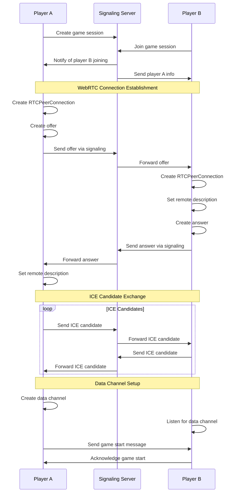

# WebRTC Integration Architecture for Go Game Application

## Overview
This document outlines the architecture for integrating WebRTC peer-to-peer communication into the Go game application. The goal is to enable direct player-to-player communication without requiring a central server for game state synchronization, while maintaining compatibility with the existing WebSocket-based architecture.

## Current Architecture
The application currently uses a client-server model with WebSocket communication:
- GameServer (src/main/server.js) manages game state and broadcasts messages
- Clients connect via WebSocket to exchange game events (moves, timer updates, etc.)
- All communication flows through the server

## Proposed WebRTC Architecture

### 1. Signaling Server
We'll maintain a minimal WebSocket signaling server for connection establishment:
- Handle player discovery and session management
- Exchange SDP offers/answers and ICE candidates
- Minimal game metadata exchange (player names, game settings)

### 2. Peer-to-Peer Communication
After establishing a WebRTC connection:
- Use RTCDataChannel for game state synchronization
- Direct exchange of game messages (moves, timer updates, etc.)
- Bypass server for all game-related communication

### 3. Component Modifications

#### Main Process Changes (src/main/)
- Create a new WebRTCManager class to handle peer connections
- Modify IPC handlers to support WebRTC connections
- Update game server to act as signaling server only

#### Renderer Process Changes (src/renderer/)
- Update app.js to handle WebRTC connections
- Add UI elements for WebRTC connection status
- Maintain compatibility with WebSocket connections

#### Shared Components (src/shared/)
- Extend protocol.js to support WebRTC-specific messages
- Add WebRTC connection states to constants.js

### 4. Connection Flow



### 5. Message Routing
- Implement a message router in both main and renderer processes
- Route messages through WebRTC when available, fallback to WebSocket
- Maintain message format compatibility between both transport methods

### 6. Fallback Mechanism
- If WebRTC connection fails, automatically fallback to WebSocket
- Maintain existing WebSocket server functionality
- Transparent to the user which transport is being used

## Implementation Plan

### Phase 1: Core WebRTC Infrastructure
1. Implement WebRTCManager class in main process
2. Add WebRTC-specific IPC handlers
3. Create signaling message extensions in protocol

### Phase 2: Connection Establishment
1. Implement offer/answer exchange
2. Handle ICE candidate exchange
3. Establish RTCDataChannel

### Phase 3: Message Routing
1. Implement message router
2. Add WebRTC connection status UI
3. Test peer-to-peer gameplay

### Phase 4: Fallback and Error Handling
1. Implement WebSocket fallback
2. Add connection error handling
3. Test reliability under various network conditions

## Technical Considerations

### NAT Traversal
- Use STUN servers for basic NAT traversal
- Consider TURN servers for complex network topologies
- Implement ICE candidate gathering and exchange

### Security
- Validate all messages received via WebRTC
- Implement proper authentication for signaling
- Ensure game state integrity with message sequencing

### Performance
- Monitor data channel buffer status
- Implement message prioritization for critical game events
- Handle connection quality degradation gracefully

## File Structure Changes
```
src/
├── main/
│   ├── webrtc/
│   │   ├── webrtc-manager.js
│   │   └── signaling-handler.js
│   └── ipc-handlers.js (modified)
├── renderer/
│   └── js/
│       └── app.js (modified)
└── shared/
    ├── protocol.js (extended)
    └── constants.js (extended)